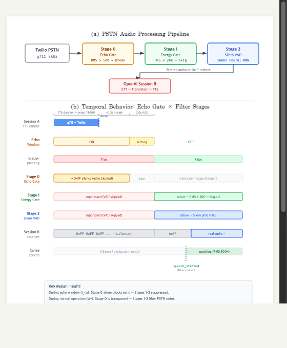
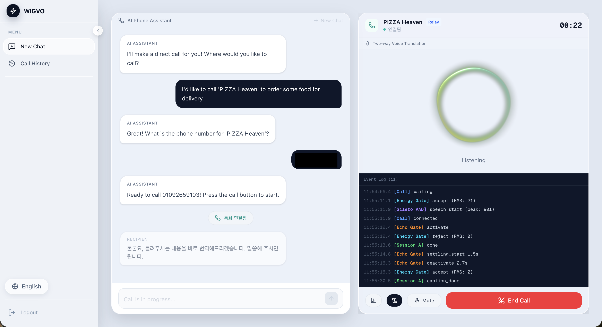

<div align="center">


<br />
<br />

**AI-Powered Realtime Phone Translation & Relay Platform**

Real-time bidirectional voice translation over actual phone calls.
No apps needed on the recipient's end. Just call.

*From zero to working PSTN bidirectional translation calls in 7 days.*
*430+ tests. Production-deployed on Google Cloud Run.*

<br />

[](https://wigvo.run)
[](#tech-stack)
[](#tech-stack)
[](#testing)

<br />

[한국어](README.ko.md)

</div>

---

## 1. Introduction

WIGVO is a server-side relay system that enables **bidirectional LLM-based speech translation over ordinary telephone calls** — without requiring app installation or carrier integration on either end. The caller speaks (or types) via a browser; the callee answers on an ordinary phone.

```
You say:      "I'd like to make a reservation for tonight"
                    ↓ OpenAI Realtime API (< 500ms)
Recipient hears:  "오늘 저녁 예약하고 싶은데요"  ← via Twilio phone call
                    ↓
Recipient says:   "네, 몇 시에 오실 건가요?"
                    ↓ OpenAI Realtime API (< 500ms)
You hear:         "Yes, what time would you like to come?"
```

### The Problem

Streaming speech-to-speech translation has advanced rapidly, but existing systems assume wideband audio and client-side acoustic echo cancellation (AEC). The **Public Switched Telephone Network (PSTN)** — still the primary inbound interface for local businesses, hospitals, and government offices — encodes audio via G.711 μ-law at 8 kHz, introduces 80–600 ms delays, and provides no AEC.

| Who | Pain Point | Scale |
|-----|-----------|-------|
| Foreigners in Korea | Can't make calls in Korean | 2.2M residents (2024) |
| Koreans abroad | Can't make calls in local language | 2.8M overseas Koreans |
| Speech/hearing disabilities | Voice calls inaccessible | 390K registered in Korea |
| Phone anxiety (콜포비아) | Avoid calls entirely | ~40% of Korean Gen-Z |

**No existing product solves bidirectional real-time voice translation + phone connection in a single platform.**

### Contributions

1. We formalize the **echo-induced translation loop** problem in streaming speech translation over telephony.
2. We propose a **dual-session gated architecture** combining directional separation, silence injection, and energy-based VAD gating for PSTN environments.
3. We deploy and evaluate a working relay server across three communication modes, achieving **zero echo-induced loops** across 147 completed PSTN calls with **555 ms median caller-to-callee latency** at **USD 0.28/min**.

---

## 2. Related Work

Simultaneous speech translation systems (SeamlessM4T, Seamless Streaming, ESPnet-ST-v2) achieve real-time quality but assume wideband audio. End-to-end full-duplex models — Moshi (200 ms latency), PersonaPlex (70 ms turn-taking), Hibiki (near-human-interpreter quality) — all require clean 24 kHz audio and do not address G.711 codec artifacts, telephony echo, or narrowband VAD failures.

In telephony AI, Google Duplex performs monolingual task completion over PSTN. Vapi and Bland.ai provide LLM-powered phone agents without cross-lingual translation. Samsung Galaxy AI and SKT A.dot solve real-time phone translation with proprietary hardware and telecom infrastructure. WIGVO solves the same problem **with software alone**, operating at the application layer.

| System | PSTN | Bidirectional | Speech-to-Speech | Echo Handling | Accessibility |
|--------|:----:|:----:|:----:|:----:|:----:|
| SeamlessM4T | | ✓ | ✓ | N/A | |
| Moshi / Hibiki | | | ✓ | N/A | |
| Google Duplex | ✓ | | | N/D | |
| Samsung Galaxy AI | ✓ | ✓ | ✓ | Hardware AEC | |
| SKT A.dot | ✓ | ✓ | ✓ | Telco-level | |
| Vapi / Bland.ai | ✓ | | | N/D | |
| FCC TRS | ✓ | ✓ | | Human | ✓ |
| **WIGVO** | **✓** | **✓** | **✓** | **✓** | **✓** |

---

## 3. System Architecture and Echo Gating

<div align="center">

<br />
<em>Figure 1: WIGVO system architecture. Session A (red) translates user speech to G.711 for Twilio; Session B (blue) receives PSTN audio through a 3-stage filter pipeline (Echo Gate → Energy Gate → Silero VAD).</em>
</div>

<br />

A browser client connects to the relay server via WebSocket, sending 16 kHz PCM audio. The relay manages **two independent Realtime LLM sessions** and a Twilio telephony gateway. An `AudioRouter` dispatches events to one of three pipelines — V2V, T2V, and Full-Agent — via the Strategy pattern.

**Dual Realtime sessions.** Session A receives browser audio (PCM16) and produces translated G.711 μ-law for the telephony gateway. Session B receives PSTN audio (G.711 μ-law, 8 kHz) and produces translated audio or captions for the browser. In T2V and Full-Agent modes, Session B performs STT only, delegating translation to a separate Chat Completion call (GPT-4o-mini, `temperature=0`) to prevent generative hallucination. Each session maintains its own system prompt and sliding context window, ensuring strict directional separation.

### 3.1 The Echo Loop Problem

In a naive single-session design, TTS output played to the callee echoes back through the PSTN after 80–600 ms, gets re-recognized, and triggers another translation cycle — generating progressively distorted paraphrases until manually interrupted. A Pearson-correlation echo detector comparing outgoing TTS with incoming audio failed in production due to μ-law nonlinear quantization and variable delays. **Without gating, 8 of 10 test calls produced echo loops; Echo Gate eliminated loops entirely (0 of 147 completed calls).**

### 3.2 Echo Gate and 3-Stage Pipeline

<div align="center">

<br />
<em>Figure 2: PSTN audio processing pipeline. (A) Three-stage filter between Twilio input and Session B. (B) Temporal behavior: during TTS playback, the Echo Gate replaces audio with μ-law silence while Stages 1–2 are suppressed; after settling, Stage 0 becomes transparent and Stages 1–2 filter PSTN noise.</em>
</div>

<br />

PSTN audio entering Session B passes through a 3-stage filter pipeline:

**Stage 0: Echo Gate.** When Session A begins streaming TTS, an *echo window* is activated. Incoming PSTN audio is replaced with μ-law silence (`0xFF`) before forwarding to Session B. A dynamic cooldown (TTS duration + 0.3 s echo round-trip margin) accounts for PSTN jitter, followed by a post-echo settling window that suppresses AGC recovery noise while permitting high-energy breakthrough (≥400 RMS) for genuine callee speech.

**Stage 1: RMS Energy Gate.** During echo windows, only signals ≥400 RMS break through as genuine speech; typical echo energy (100–400 RMS) remains suppressed. Outside echo windows, a 150 RMS threshold filters line noise. A three-level interrupt priority (callee > caller > AI TTS) enables natural turn-taking.

**Stage 2: Silero VAD.** Frames passing the energy gate are processed by Silero VAD. PSTN audio (8 kHz) is upsampled to 16 kHz via zero-order hold before inference. Asymmetric hysteresis — onset at 96 ms (probability ≥ 0.5, three frames), offset at 480 ms (probability < 0.35, 15 frames) — reduces `speech_stopped` latency from 15–72 s (server VAD on PSTN) to **480 ms**.

### 3.3 PSTN VAD Failures and Robustness

The Realtime API's server-side VAD fails on the telephone network in three ways: (1) constant low-level noise is classified as speech, causing 15–72 s stuck durations; (2) the noisy telephone floor prevents energy from dropping below the silence threshold; (3) audio discontinuities during echo suppression prevent clean silence detection. The three-stage pipeline addresses all three. A 15-pattern STT hallucination blocklist intercepts broadcast-style Whisper artifacts (e.g., "Thanks for watching," "MBC 뉴스 이덕영입니다").

### 3.4 Guardrail System

Real-time translation must balance speed and quality. A 3-level guardrail system adds **zero latency** in 95%+ of cases:

| Level | Trigger | Action | Added Latency |
|-------|---------|--------|---------------|
| **L1** | Clean translation | Pass through | **0 ms** |
| **L2** | Informal speech detected | TTS immediately, correct in background | **0 ms** |
| **L3** | Profanity / harmful content | Block + filler audio + GPT-4o-mini correction | **~800 ms** |

### 3.5 Session Recovery

OpenAI Realtime sessions can drop mid-call. A 30-second ring buffer retains undelivered audio chunks. On reconnect, unsent audio is batch-transcribed via Whisper and re-injected. After 10 s failure, the system switches to degraded mode (Whisper STT + GPT-4o-mini translation).

<details>
<summary><b>Engineering Deep Dive: VAD — 7-Step Evolution (11 commits in one day)</b></summary>

The longest single debugging session in WIGVO's development. The recipient was clearly speaking, but the system couldn't detect their speech. **Root cause**: PSTN audio characteristics were fundamentally underestimated.

**Step 1: OpenAI Server VAD** — Trusted built-in Server VAD (`threshold: 0.5, silence_duration: 200ms`). PSTN background noise (RMS 50–200) looked like "still speaking." `speech_stopped` never fired.

**Step 2: Server VAD Tuning** — Raised threshold to 0.8, silence duration to 600 ms. Too aggressive — quiet speakers were completely ignored.

**Step 3: Energy Threshold Lowering** — Tried 150 → 80 → 30 → 20. Lower = PSTN noise passes through = VAD stuck again. Higher = real speech filtered out.

**Step 4: Dynamic Energy Threshold** — Context-dependent: 400 RMS during echo window, 80 RMS normally. Still failed on post-echo-window noise.

**Step 5: Critical Discovery — "Don't Drop Audio, Replace It"** — When noisy audio was *dropped*, the Server VAD interpreted this as "audio stream interrupted" — not as silence. **Solution**: Replace with silence frames (`0xFF` mu-law) instead of dropping. The stream stays continuous, and VAD correctly recognizes silence.

```python
# WRONG — VAD gets stuck (no data = "still waiting")
if rms < threshold:
    return  # drop

# CORRECT — VAD detects silence normally
if rms < threshold:
    silence = b"\xff" * len(audio)  # mu-law silence
    await session_b.send_audio(base64.b64encode(silence))
```

**Step 6: Max Speech Timer** — 8-second safety net for PSTN noise spikes above RMS 200.

**Step 7: Abandon Server VAD — Local Silero VAD** — OpenAI Server VAD fundamentally cannot handle PSTN audio. Replaced entirely with 2-stage local Silero VAD. Additional hurdles: 8kHz→16kHz upsampling, 20ms→32ms frame adaptation, Silero RNN state management, Cloud Run gVisor ELF binary patch.

| Metric | Before | After |
|--------|--------|-------|
| Speech-end detection | 15–72 seconds | **480 ms** |
| Translation start (E2E) | 15+ seconds | **~3 seconds** |

Commit trail:
```
09ac3c3 → 20eb470 → 309c502 → 0ccc389 → 8488084 → 2554628 → e83c9d5 → 6f4668f → 3330eeb → b8f552e → 6569d76
```

</details>

<details>
<summary><b>Engineering Deep Dive: Echo Cancellation — From Correlation to Silence Injection</b></summary>

**Attempt 1: Pearson Correlation Echo Detector** — Compared outgoing TTS with incoming audio using per-chunk correlation. Failed due to μ-law nonlinear quantization, variable PSTN delays, and codec distortion. Reduced echo loops from 8/10 to 3/10 but introduced frequent false positives. Removed from codebase.

**Solution: Silence Injection + Dynamic Cooldown** — During TTS playback ("echo window"), all incoming Twilio audio is replaced with mu-law silence frames (`0xFF`). Cooldown = remaining TTS playback time + 0.3 s echo round-trip margin.

```
Echo window lifecycle:
  TTS chunk arrives     → Activate echo window
  TTS complete          → Start dynamic cooldown
  Cooldown expired      → Post-echo settling (AGC recovery)
  Settling expired      → Normal operation

Dynamic cooldown:
  Short utterance ("네"): ~0.8s
  Long sentence:          ~3.0s
```

This approach is simpler and more robust than signal-level echo detection, achieving **0 echo-induced loops across 147 completed calls** while preserving natural turn-taking through 354 callee interruptions.

</details>

---

## 4. Evaluation

Evaluated on **162 instrumented PSTN calls** (169 total, since Feb 23, 2026) for Korean↔English translation across Voice-to-Voice, Text-to-Voice, and Full-Agent modes.

### 4.1 Latency

<div align="center">

<br />
<em>Figure 3: End-to-end latency distributions. Session A (caller→callee, N=814 turns) and Session B (callee→caller, N=744 turns) over live PSTN calls.</em>
</div>

<br />

| Stage | P50 | P95 | Mean | N |
|-------|----:|----:|-----:|--:|
| **Session A** (User→Recipient) | **557 ms** | 1156 ms | 617 ms | 814 turns |
| **Session B E2E** (Recipient→User) | **2868 ms** | 15482 ms | 3997 ms | 744 turns |
| Session B STT only | 2675 ms | 15547 ms | 3868 ms | 744 turns |
| Session B Translation only | 104 ms | 1934 ms | 535 ms | 585 turns |
| First message latency | 1215 ms | 6890 ms | 2081 ms | 162 calls |

Session A achieves **555 ms median**, within the range for interactive communication. STT (Whisper) dominates Session B latency, accounting for **87.3%** of end-to-end time. The P95 (15482 ms) is driven by PSTN VAD stuck events — server-side VAD on noisy telephone audio occasionally delays `speech_stopped` detection.

While Session B's ~2.9 s median exceeds ITU-T G.114's 150 ms one-way threshold, that standard applies to same-language dialogue. A more appropriate baseline is professional simultaneous interpretation, where ear-voice span ranges from **2 to 5 s**; Session B falls at the lower bound.

<div align="center">

<br />
<em>Figure 4: Utterance length vs. Session B E2E latency. Pearson r=0.400 (p < 0.001), confirming that longer recipient utterances incur higher ASR-dominated latency.</em>
</div>

### 4.2 Echo and Safety

| Metric | Total | Per Call |
|--------|------:|---------:|
| Echo gate activations | 1128 | 7.0 |
| Echo gate breakthroughs (callee interrupt) | 358 | 2.2 |
| Settling breakthroughs | 20 | 0.1 |
| **Echo-induced translation loops** | **0** | **0** |
| VAD false triggers | 286 | 1.8 |
| Hallucinations blocked | 109 | 0.7 |
| Guardrail L2 / L3 | 148 / 0 | — |

**Zero echo-induced translation loops** across 162 instrumented calls, whereas early prototypes without gating reliably produced such loops. The echo gate permitted **358 callee interruptions** during active TTS playback, confirming that the energy-based override preserves natural turn-taking.

### 4.3 Cost

| Metric | Value |
|--------|-------|
| Total calls | 169 |
| Total duration | 241.4 min |
| Total cost | $64.71 |
| **Cost per minute** | **$0.27** |
| Cost per call | $0.40 |

These costs reflect dual-session Realtime API pricing and remain an order of magnitude cheaper than professional telephone interpretation services ($1–3/min).

### 4.4 Baseline Comparison

No existing system performs bidirectional cross-lingual speech translation over PSTN, so we report absolute rather than comparative metrics.

| System | Network | Bidirectional | Latency |
|--------|---------|:----:|---------|
| Seamless Streaming | Wideband | | < 2 s AL |
| Moshi | Wideband | | ~200 ms |
| Hibiki | Wideband | | 2.8–5.6 s LAAL |
| Google Duplex | PSTN | | N/D |
| Vapi | WebRTC/PSTN | | ~965 ms* |
| Bland.ai | PSTN | | < 400 ms* |
| **WIGVO Session A** | **PSTN** | **✓** | **557 ms P50** |
| **WIGVO Session B** | **PSTN** | **✓** | **2868 ms P50** |

*Vendor-reported; independent reviews report higher values. All non-WIGVO systems are monolingual (no cross-lingual translation).*

Twilio's industry benchmark for AI voice agents targets 1115 ms median turn gap. Session A (557 ms) falls well within this target; Session B (2868 ms) exceeds it but includes cross-lingual translation that monolingual agents do not perform.

---

## 5. Demonstration

<div align="center">

<br />
<em>Figure 5: WIGVO web interface during a V2V call — real-time bilingual captions with chat history and call controls.</em>
</div>

<br />

A session proceeds as: (1) select a scenario, (2) chat with the AI agent to provide caller intent and phone number, (3) the system places a PSTN call with bidirectional translation, and (4) real-time captions appear alongside call status. Mode switching (V2V, T2V, Full-Agent) is available during active calls.

### Communication Modes

Each communication mode is handled by a dedicated pipeline (Strategy pattern):

| Mode | Pipeline | Input | Output | For |
|------|----------|-------|--------|-----|
| **Voice → Voice** | `VoiceToVoicePipeline` | Speak your language | Translated speech + captions | General users |
| **Text → Voice** | `TextToVoicePipeline` | Type text | AI speaks for you via phone | Speech disabilities, phone anxiety |
| **Agent Mode** | `FullAgentPipeline` | Provide info upfront | AI handles entire call autonomously | Anyone |

---

## Tech Stack

| Layer | Technology | Why |
|-------|-----------|-----|
| **Relay Server** | Python 3.12+, FastAPI, uvicorn | Async WebSocket handling, low latency |
| **Web App** | Next.js 16, React 19, shadcn/ui, Zustand | SSR, real-time UI updates |
| **Mobile App** | React Native, Expo SDK 54 | Cross-platform, expo-av for audio |
| **Realtime AI** | OpenAI Realtime API (GPT-4o) | Sub-second STT + Translation + TTS |
| **Chat AI** | GPT-4o-mini | Cost-efficient data collection + T2V/Agent translation |
| **Local VAD** | Silero VAD (lightweight RNN) | PSTN-grade speech detection |
| **Telephony** | Twilio (REST + Media Streams) | Reliable phone call infrastructure |
| **Database** | Supabase (PostgreSQL + Auth + RLS) | Real-time subscriptions, row-level security |
| **Deploy** | Docker, Google Cloud Run | Auto-scaling, zero cold start |

---

## Project Structure

```
apps/
├── relay-server/                    # Python FastAPI — Real-time Translation Engine
│   ├── src/
│   │   ├── main.py                  # FastAPI entrypoint + lifespan
│   │   ├── call_manager.py          # Call lifecycle singleton
│   │   ├── config.py                # pydantic-settings env config
│   │   ├── types.py                 # ActiveCall, CostTokens, WsMessage, etc.
│   │   ├── routes/                  # HTTP + WebSocket endpoints
│   │   ├── realtime/                # OpenAI Realtime session management
│   │   │   ├── pipeline/            # Strategy pattern — mode-specific pipelines
│   │   │   │   ├── base.py          # BasePipeline ABC
│   │   │   │   ├── voice_to_voice.py # V2V (Echo Gate + Silence Injection)
│   │   │   │   ├── text_to_voice.py  # T2V (Chat API translation)
│   │   │   │   └── full_agent.py     # Agent (function calling)
│   │   │   ├── chat_translator.py    # Chat API translator (GPT-4o-mini)
│   │   │   ├── audio_router.py      # Thin delegator → pipeline selection
│   │   │   ├── local_vad.py         # Silero neural VAD + RMS energy gate
│   │   │   ├── sessions/            # Dual session handlers (A + B)
│   │   │   ├── context_manager.py   # 6-turn sliding context window
│   │   │   └── recovery.py          # Session failure recovery + degraded mode
│   │   ├── guardrail/               # 3-level translation quality system
│   │   ├── tools/                   # Agent Mode function calling
│   │   └── prompt/                  # System prompt templates
│   ├── tests/                       # 430+ pytest tests
│
├── web/                             # Next.js 16 — Chat Agent + Call Monitor
│   ├── app/                         # Dashboard, API routes, call pages
│   ├── lib/                         # Services, Supabase, scenarios
│   ├── hooks/                       # useChat, useRelayWebSocket, etc.
│   └── components/                  # chat/, call/, dashboard/, ui/
│
└── mobile/                          # React Native (Expo) — VAD + Audio Client
    ├── app/                         # Expo Router
    ├── hooks/                       # useRealtimeCall, useClientVad
    └── lib/vad/                     # VAD core (processor, ring buffer)
```

---

## Getting Started

### Prerequisites

- Python 3.12+ / Node.js 18+
- [uv](https://docs.astral.sh/uv/) (Python package manager)
- [ngrok](https://ngrok.com/) (Twilio webhooks in dev)
- API keys: OpenAI, Twilio, Supabase, Naver (optional)

### Quick Start

```bash
# 1. Clone
git clone https://github.com/wigtn/wigvo-v2.git
cd wigvo-v2

# 2. Relay Server
cd apps/relay-server
cp .env.example .env          # Fill in API keys
uv sync
uv run uvicorn src.main:app --reload --port 8000

# 3. Web App (new terminal)
cd apps/web
cp .env.example .env.local    # Fill in API keys
npm install
npm run dev

# 4. ngrok (new terminal)
ngrok http 8000               # Copy URL to .env RELAY_SERVER_URL
```

### Testing

```bash
# Unit tests (430+ tests, no server needed)
cd apps/relay-server
uv run pytest -v

# Integration tests (requires running server)
uv run python -m tests.run --suite integration

# E2E call test (requires Twilio + OpenAI keys)
uv run python -m tests.run --test call --phone +82... --scenario restaurant --auto
```

---

## Appendix: Production Metrics (since 2026-02-23)

Extended production data beyond the paper's evaluation. Data collected via `scripts/eval/` from Supabase.

### Latest Single-Call Benchmark (Feb 27, 2026)

A real V2V call to a Korean immigration office — English-speaking caller inquiring about visa extension documents. 116 seconds, 11 utterances (5 user, 5 recipient, 1 AI greeting).

| Metric | Paper (148 calls) | Latest Call | Note |
|--------|------------------:|------------:|------|
| **Session A P50** | 555 ms | 611 ms | Consistent within variance |
| **Session A P95** | 1169 ms | 751 ms | Tighter distribution (6 turns) |
| **Session B E2E P50** | 2868 ms | 7823 ms | Longer Korean utterances (STT = 97.8% of E2E) |
| **Session B STT P50** | 2675 ms | 6959 ms | V2V mode — Realtime API handles STT+translate+TTS |
| **First message** | 1215 ms | 787 ms | Faster cold start |
| **Cost/min** | $0.27 | **$0.18** | 33% lower |
| **Echo loops** | 0 / 148 calls | 0 | Zero tolerance maintained |
| **Echo gate activations** | 7.0/call | 5 | |
| **VAD false triggers** | 1.8/call | 1 | |
| **Hallucinations blocked** | 0.7/call | 1 | |
| **Guardrail L2 / L3** | 148 / 0 total | 2 / 0 | |

Session B's higher latency is driven by utterance length — the recipient's Korean responses averaged 40+ characters, placing them in the upper-half bucket (see Utterance Length vs. Latency below). Pearson r = 0.887 for this call confirms strong length–latency correlation.

<details>
<summary><b>Full Transcript: Visa Extension Inquiry (en → ko)</b></summary>

```
[AI]        안녕하세요, 고객을 대신한 AI 번역 서비스로 전화드렸습니다.
            이제 고객님의 말씀을 전달해드리겠습니다.

[User]      Hi, I received a message saying there is a problem with
            my visa extension documents.
         → 안녕하세요, 제가 비자 연장 서류에 문제가 있다는 메시지를 받았는데요.

[User]      Can you tell me what's missing?
         → 어떤 서류가 빠졌는지 알려주실 수 있을까요?

[Recipient] Just a moment.

[Recipient] 고용계약서에 회사 직인이 누락되어 있고 거주지 증명서의 유효기간이
            만료된 상태네요.
         → It looks like the employer's signature is missing from the
            employment contract, and the proof of residence document
            has expired.

[User]      Can I submit the corrected documents by email or fax?
         → 수정된 서류를 이메일이나 팩스로 보내드려도 될까요?

[Recipient] Email is not possible, but you can submit it via fax,
            through the Hi Korea website upload, or by visiting
            in person.

[User]      그럼 팩스로 보내겠습니다. 팩스 번호를 알려주시고, 보낸 뒤에
            확인 전화가 필요한지도 말씀해 주시겠어요?

[Recipient] 번호는 02-123-4567 이구요. 발송 후 담당자에게 확인 전화를
            주시면 처리가 더 빨리 진행됩니다.
         → The number is 02-123-4567, and after sending, if you give
            the person in charge a confirmation call, it will be
            processed more quickly.

[User]      Okay, thanks a lot. Have a nice day.
         → 네, 감사합니다. 좋은 하루 되세요.

[Recipient] Thank you.
```

*Call ID: `e2b35f79` | Duration: 116s | Cost: $0.35 ($0.18/min)*

</details>

### Mode Distribution

| Mode | Calls | % | SA P50 | SB P50 |
|------|------:|--:|-------:|-------:|
| **Text-to-Voice** | 116 | 68.6% | 487 ms | 2557 ms |
| **Voice-to-Voice** | 52 | 30.8% | 603 ms | 2476 ms |
| **Agent** | 1 | 0.6% | — | — |

### Utterance Length vs. Latency

| Char Length | N | P50 | P95 | Mean |
|------------|--:|----:|----:|-----:|
| ≤30 chars | 565 | 2502 ms | 6511 ms | 3119 ms |
| 31–60 chars | 132 | 4713 ms | 15692 ms | 5860 ms |
| 61–100 chars | 32 | 7596 ms | 18402 ms | 8922 ms |
| 100+ chars | 15 | 11100 ms | 18716 ms | 10185 ms |

*Pearson r = 0.400 (char length vs. SB latency)*

### Cost per Minute (by Mode, Cumulative)

| Mode | Calls | Cost/min |
|------|------:|---------:|
| Voice-to-Voice | 67 | $0.3028 |
| Text-to-Voice | 138 | $0.2943 |
| Agent | 3 | $0.2991 |

*Cost based on OpenAI Realtime API (audio input $0.06/1K, audio output $0.24/1K) + GPT-4o-mini Chat API for T2V/Agent translation.*

---

## Market Opportunity

| Segment | TAM (Korea) | Willingness to Pay |
|---------|------------|-------------------|
| Foreign residents | 2.2M (growing 8% YoY) | High — daily necessity |
| Overseas Koreans | 2.8M | Medium — occasional use |
| Disability services | Government-funded programs | Institutional contracts |
| Phone anxiety (Gen-Z) | ~4M estimated | Subscription model |

---

## License

MIT License. See [LICENSE](LICENSE) for details.

---

<div align="center">

Built in 7 days with OpenAI Realtime API, Twilio, Supabase, and a lot of PSTN audio debugging.

</div>
